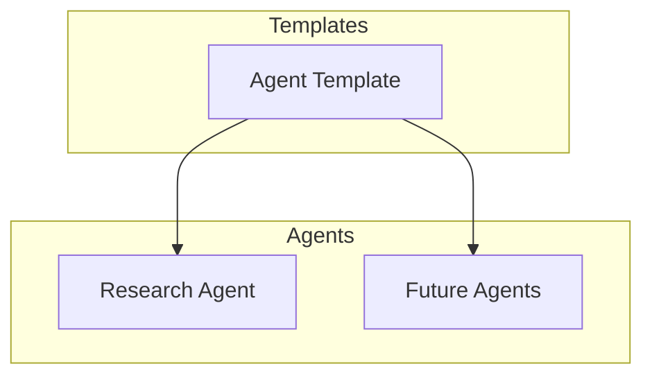

# System Patterns

## Architecture Overview
The system is structured around individual agents (monobots) with specific capabilities, built using TypeScript for type safety and consistency.

## Design Patterns
1. Template Pattern
   - Base agent template provides common structure
   - Specialized agents extend template functionality
   - Ensures consistent implementation across agents

2. Modular Architecture
   - Each agent is a self-contained module
   - Clear separation of concerns between agents
   - Standardized interfaces for agent interaction

## Component Relationships

## Key Technical Decisions
1. TypeScript Implementation
   - Strong typing for better development experience
   - Interface-driven development
   - Compile-time error checking

2. Agent Template System
   - Standardized base template
   - Common utilities and helper functions
   - Type-safe agent creation

3. Research Agent Implementation
   - Specialized research capabilities
   - Modular design for extensibility
   - Type-safe API integration

## System Constraints
1. Type Safety
   - All components must maintain TypeScript type safety
   - Interfaces must be properly defined
   - Type checking must be enforced

2. Template Compliance
   - New agents must extend base template
   - Common patterns must be followed
   - Consistent implementation required
