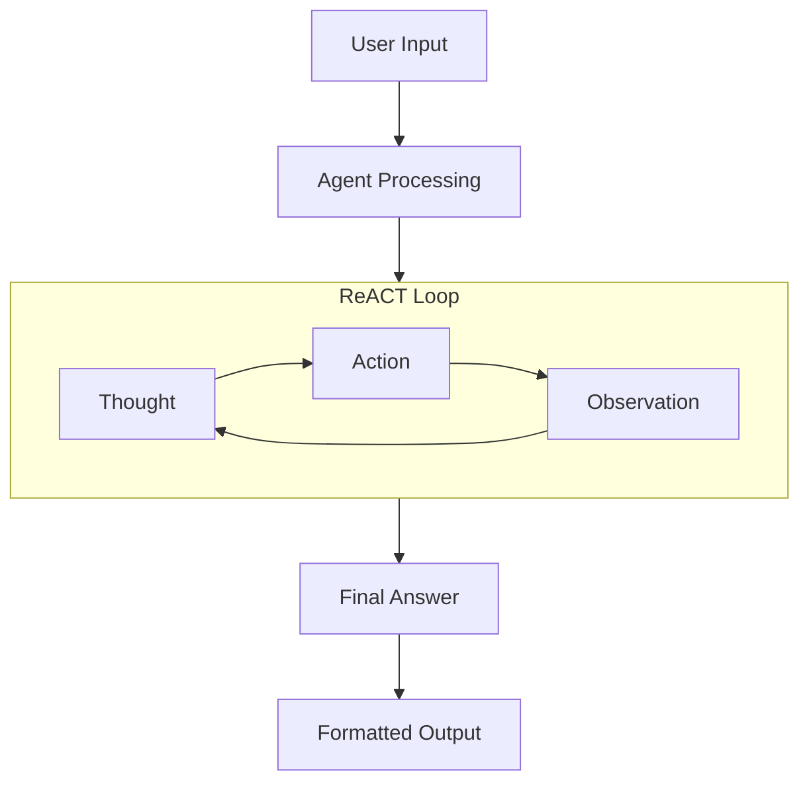
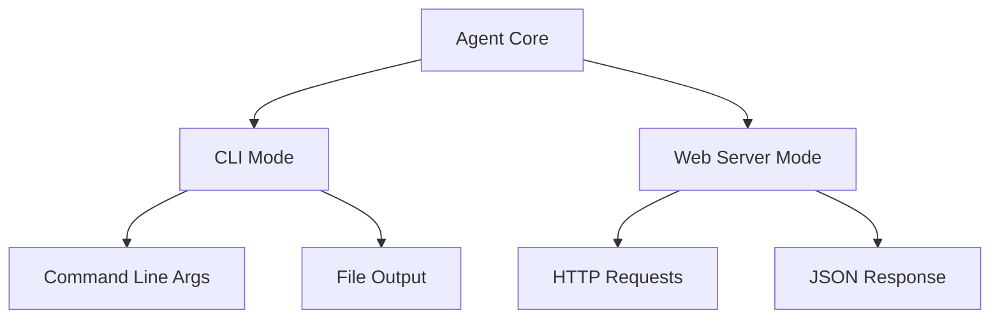
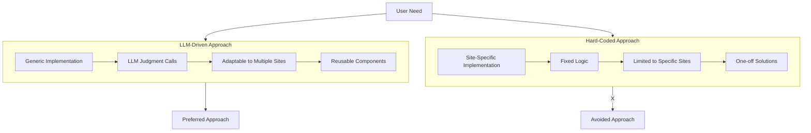
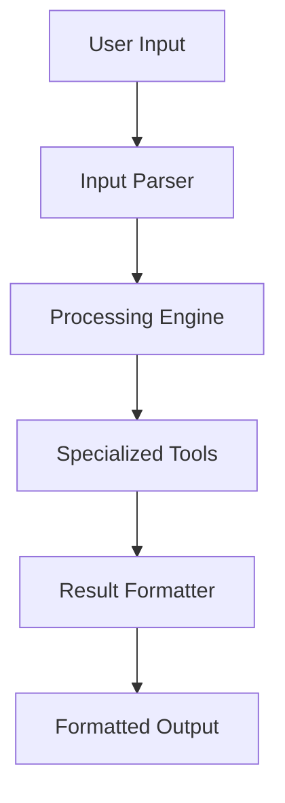

# System Patterns

## System Architecture

### ReACT Pattern Implementation



The core architecture follows the ReACT (Reasoning + Acting) pattern:

1. **Thought**: Agent analyzes the current state and decides next steps
2. **Action**: Agent executes a tool with specific input
3. **Observation**: Agent processes tool output and updates state
4. Loop continues until reaching a final answer

### Dual-Mode Operation



Each agent supports two operational modes:

1. **CLI Mode**: Direct command-line interaction
2. **Web Server Mode**: HTTP API endpoint

## Key Technical Decisions

### 1. Single File Architecture

- Complete agent implementation in one file
- Self-contained functionality
- No external dependencies beyond Deno standard library
- Simplified deployment and maintenance

### 2. Tool System

```typescript
interface Tool {
  name: string;
  description: string;
  run: (input: string) => Promise<string> | string;
}
```

- Standardized tool interface
- Async/sync support
- String-based input/output
- Self-documenting through descriptions

### 3. Message Structure

```typescript
interface ChatMessage {
  role: "system" | "user" | "assistant";
  content: string;
}
```

- Consistent message format
- Role-based context management
- Compatible with common LLM APIs

### 4. Error Handling

- Fallback mechanism using last observation
- Step limit protection
- API error recovery
- Environment validation

## Design Patterns

### 1. Factory Pattern

- Template-based agent creation
- Standardized configuration
- Consistent implementation structure

### 2. Observer Pattern

- Tool execution monitoring
- Error tracking
- Console logging for debugging

### 3. Strategy Pattern

- Configurable output formats
- Flexible tool implementation
- Runtime mode selection

### 4. Command Pattern

- Tool execution abstraction
- Action parsing and execution
- Error handling standardization

## Component Relationships

### 1. Configuration Layer

- Environment variables
- Server settings
- Agent parameters
- Output preferences

### 2. Core Processing Layer

- Message management
- ReACT loop implementation
- Tool coordination
- State tracking

### 3. Tool Layer

- Tool registration
- Execution handling
- Result processing
- Error management

### 4. Output Layer

- Format selection
- File generation
- Response formatting
- Error reporting

## Implementation Guidelines

### 1. Tool Implementation

```typescript
const tools: Tool[] = [
  {
    name: "ToolName",
    description: "Tool description for LLM context",
    run: async (input: string) => {
      // Implementation
      return result;
    },
  },
];
```

### 2. Error Handling Pattern

```typescript
try {
  const result = await operation();
  if (fallbackNeeded) {
    return lastObservation;
  }
  return result;
} catch (err) {
  if (lastObservation) {
    return `Based on previous results: ${lastObservation}`;
  }
  throw err;
}
```

### 3. Output Formatting

```typescript
function formatOutput(query: string, answer: string): string {
  switch (OUTPUT_FORMAT) {
    case "markdown":
      return markdownFormat();
    case "json":
      return jsonFormat();
    default:
      return textFormat();
  }
}
```

## Technical Constraints

1. **Runtime Environment**

   - Deno runtime required
   - TypeScript support
   - Network access for API calls
   - Puppeteer for web automation

2. **API Dependencies**

   - LLM API access (for some agents)
   - Direct web interaction (for scraping agents)
   - Tool-specific API requirements
   - Authentication handling

3. **Resource Limitations**

   - Token limits for LLM calls
   - Step limits for reasoning loops
   - Memory management for long operations
   - Browser resource management for Puppeteer

4. **Security Boundaries**
   - API key management
   - Input validation
   - Output sanitization
   - Web scraping ethics and rate limiting

## Core Philosophy and Patterns

### 1. LLM-Driven Flexibility vs. Hard-Coded Solutions



The project's core philosophy is to leverage LLMs for making judgment calls that enable generic, flexible solutions:

- **Preferred**: LLM-driven solutions that can adapt to different contexts
- **Avoided**: Hard-coded, site-specific implementations that require custom code for each use case

This philosophy guides all implementation decisions and ensures that agents remain:
- Adaptable across different websites and contexts
- Maintainable without requiring constant updates for site changes
- Reusable for similar tasks across different domains
- Aligned with the project's goal of creating intelligent, flexible agents

### 2. Direct Implementation Pattern

Some agents use direct implementation rather than LLM-driven reasoning:



This pattern:
- Eliminates dependency on external LLM APIs
- Provides more predictable performance
- Allows for specialized algorithms
- Reduces operational costs

**Important Note**: Even when using direct implementation, the agent should maintain flexibility and avoid hard-coding site-specific logic. The implementation should focus on generic algorithms that can work across different contexts, rather than creating one-off solutions for specific sites.

#### Anti-Pattern Example: Hard-Coded Selectors

The following example shows a hard-coded approach that should be avoided:

```typescript
// Hard-coded selectors for specific types of elements
const containerSelectors = [
  '.product-card', 
  '.product-wrap', 
  '.product', 
  '.product-item',
  '.grid__item',
  '[data-product-card]'
];

const titleSelectors = [
  '.product-title', 
  '.product-name', 
  '.product-card__title',
  'h2', 
  'h3',
  '.title'
];

// Site-specific assumptions about DOM structure
const bestContainer = containerResults.reduce((best, current) => 
  current.count > best.count ? current : best, 
  { selector: '', count: 0 }
);
```

This approach has several limitations:
- Limited to predefined selectors that may not work across different sites
- Lacks the ability to adapt to new or changing website structures
- Requires manual updates when websites change their DOM structure
- Creates one-off solutions rather than reusable components

Instead, prefer approaches that leverage LLM judgment calls to dynamically analyze and adapt to different website structures, as implemented in the selector-finder agent.

### 3. Natural Language Query Parsing

For agents like the Selector Finder:

```typescript
function parseQuery(query: string): { url: string; contentDescription: string } {
  // Extract URL from query
  const urlPattern = /(https?:\/\/[^\s]+)/g;
  const urlMatches = query.match(urlPattern);
  
  // Extract content description
  let contentDescription = query.replace(url, "").trim();
  
  // Clean up and normalize
  contentDescription = contentDescription
    .replace(/^find\s+/i, "")
    .replace(/\s+on\s+$/i, "");
  
  return { url, contentDescription };
}
```

This pattern enables:
- More natural user interaction
- Flexible query formats
- Intent extraction from natural language
- Context-aware processing

### 4. Content-Type Awareness

For specialized agents like the Selector Finder:

```typescript
function determineContentType(description: string): string {
  if (description.includes("product") || description.includes("price")) {
    return "product";
  } else if (description.includes("article") || description.includes("blog")) {
    return "article";
  } else if (description.includes("nav") || description.includes("menu")) {
    return "navigation";
  }
  // Default fallback
  return "generic";
}
```

This pattern enables:
- Domain-specific processing
- Specialized selector generation
- Improved accuracy for different content types
- Better user experience through specialization
