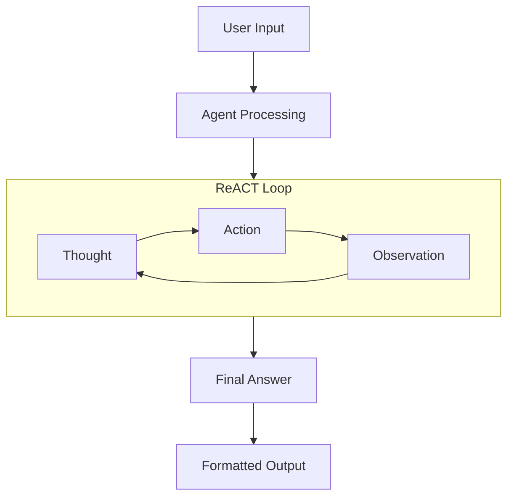
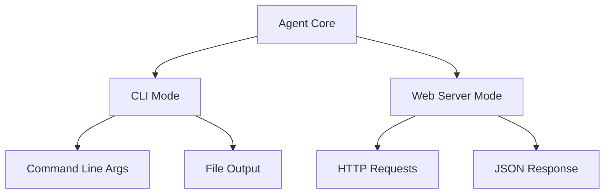

# System Patterns

## System Architecture

### ReACT Pattern Implementation



The core architecture follows the ReACT (Reasoning + Acting) pattern:

1. **Thought**: Agent analyzes the current state and decides next steps
2. **Action**: Agent executes a tool with specific input
3. **Observation**: Agent processes tool output and updates state
4. Loop continues until reaching a final answer

### Dual-Mode Operation



Each agent supports two operational modes:

1. **CLI Mode**: Direct command-line interaction
2. **Web Server Mode**: HTTP API endpoint

## Key Technical Decisions

### 1. Single File Architecture

- Complete agent implementation in one file
- Self-contained functionality
- No external dependencies beyond Deno standard library
- Simplified deployment and maintenance

### 2. Tool System

```typescript
interface Tool {
  name: string;
  description: string;
  run: (input: string) => Promise<string> | string;
}
```

- Standardized tool interface
- Async/sync support
- String-based input/output
- Self-documenting through descriptions

### 3. Message Structure

```typescript
interface ChatMessage {
  role: "system" | "user" | "assistant";
  content: string;
}
```

- Consistent message format
- Role-based context management
- Compatible with common LLM APIs

### 4. Error Handling

- Fallback mechanism using last observation
- Step limit protection
- API error recovery
- Environment validation

## Design Patterns

### 1. Factory Pattern

- Template-based agent creation
- Standardized configuration
- Consistent implementation structure

### 2. Observer Pattern

- Tool execution monitoring
- Error tracking
- Console logging for debugging

### 3. Strategy Pattern

- Configurable output formats
- Flexible tool implementation
- Runtime mode selection

### 4. Command Pattern

- Tool execution abstraction
- Action parsing and execution
- Error handling standardization

## Component Relationships

### 1. Configuration Layer

- Environment variables
- Server settings
- Agent parameters
- Output preferences

### 2. Core Processing Layer

- Message management
- ReACT loop implementation
- Tool coordination
- State tracking

### 3. Tool Layer

- Tool registration
- Execution handling
- Result processing
- Error management

### 4. Output Layer

- Format selection
- File generation
- Response formatting
- Error reporting

## Implementation Guidelines

### 1. Tool Implementation

```typescript
const tools: Tool[] = [
  {
    name: "ToolName",
    description: "Tool description for LLM context",
    run: async (input: string) => {
      // Implementation
      return result;
    },
  },
];
```

### 2. Error Handling Pattern

```typescript
try {
  const result = await operation();
  if (fallbackNeeded) {
    return lastObservation;
  }
  return result;
} catch (err) {
  if (lastObservation) {
    return `Based on previous results: ${lastObservation}`;
  }
  throw err;
}
```

### 3. Output Formatting

```typescript
function formatOutput(query: string, answer: string): string {
  switch (OUTPUT_FORMAT) {
    case "markdown":
      return markdownFormat();
    case "json":
      return jsonFormat();
    default:
      return textFormat();
  }
}
```

## Technical Constraints

1. **Runtime Environment**

   - Deno runtime required
   - TypeScript support
   - Network access for API calls

2. **API Dependencies**

   - LLM API access (OpenRouter)
   - Tool-specific API requirements
   - Authentication handling

3. **Resource Limitations**

   - Token limits for LLM calls
   - Step limits for reasoning loops
   - Memory management for long operations

4. **Security Boundaries**
   - API key management
   - Input validation
   - Output sanitization
